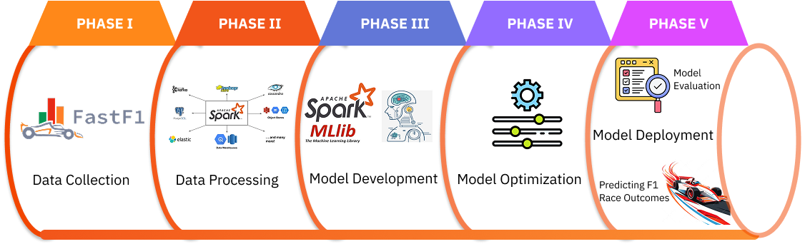

# UEH Big Data Final Project - An Application of Big Data in Analyzing and Forecasting Formula 1 Results
<h1 align="center">

</h1> 

A comprehensive data pipeline for collecting, processing, and analyzing Formula 1 racing data to predict race outcomes using machine learning and big data technology. 

# Overview
This project implements an end-to-end data pipeline for Formula 1 racing analytics. It collects historical race data from the FastF1 API, processes and transforms the data using Apache Spark, and builds machine learning models to predict race outcomes. The pipeline is designed to be scalable, maintainable, and reproducible.

## Main Features
- Access to F1 Telementry data via FastF1 API.
- Perform Data Cleaning and validation.
- Predict the race results.

## Pipeline
<h2 align="center">

</h2> 
- The pipeline follows a modern data engineering architecture:

- Data Collection: Raw data extraction from [FastF1 API](https://docs.fastf1.dev/).

- Data Processing: Transformation using Apache Spark.

- Feature Engineering: Creating predictive features from raw data.

- Model Training: Building and evaluating ML models.

- Prediction: Forecasting race outcomes.
